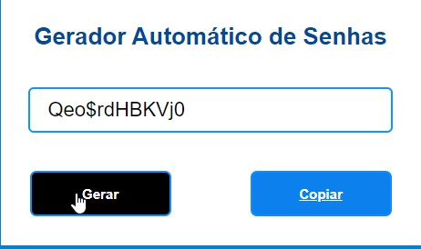
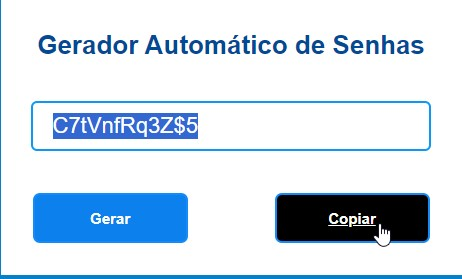

# Gerador de Senhas

## Descrição

Projeto simples de um gerador de senhas desenvolvido com HTML, CSS e JavaScript. O gerador permite a criação de senhas aleatórias que podem ser copiadas e coladas conforme necessário.

## Funcionalidades

- Geração automática de senhas seguras.
- Opção para copiar a senha gerada para a área de transferência.
- Após gerar e clicar em copiar , a senha gerada é apagada de imediato.

## Como Usar

1. Abra o arquivo `index.html` no seu navegador.
2. Digite o comprimento desejado da senha.
3. Clique em "Gerar" para obter uma senha aleatória.
4. Clique em "Copiar" para copiar a senha para a área de transferência.

## Pré-requisitos

- Navegador da web moderno.

## Autor

- [4ndreDev](https://github.com/4ndreDev)
- [Linkedin](https://www.linkedin.com/in/andr%C3%A9-luis-3073aa2ab/)

